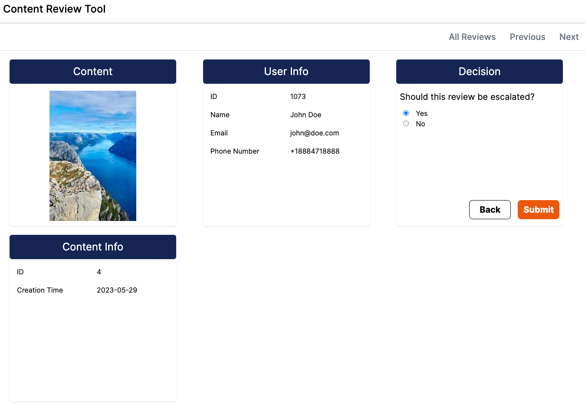

# Content Review Tool

This is an open-source content review tool. It can enable you to review content by setting up queues and review objects, and providing a UI to review those objects. It also features the ability to set up custom decision trees for your queues. You can read the full product spec [here](https://docs.google.com/document/d/1GcjrolAkemedJYWHDe9G63NyJ0MOy9ej5mvuh7tyrww/edit).

## Tech Stack

The app is organized into a frontend (cr-frontend) and backend (cr-backend) app. The frontend is written in Typescript using React, on the [NextJS](https://nextjs.org/) 13 framework. The backend is written in Python, on the [Django](https://www.djangoproject.com/) framework. The app sets up postgres for its DB. By default, it assumes a user `admin` can access the database `cr` and create databases (see [setup.sql](https://github.com/shug2k/content-review-tool/blob/main/cr-backend/setup.sql) for the commands to run to set up the database).

Currently, only running locally is supported out of the box, with Docker support on both the frontend and backend coming soon.

## Running Locally

To run locally for development:

1. Install postgresql, Python 3.10 or greater, and NodeJS
2. Ensure postgres is running
3. Run the commands in [setup.sql](https://github.com/shug2k/content-review-tool/blob/main/cr-backend/setup.sql) for postgres
4. Run `npm i` in `cr-frontend`
5. Run `pip install -r requirements.txt` in `cr-backend`
6. Run `npm run dev` in `cr-frontend` in one window
7. In another window, run `python manage.py migrate` to run migrations (if this fails, you probably set up your postgres incorrectly)
8. Run `python manage.py runserver` in `cr-backend`

## Getting Started

Once you have the frontend and backend up and running, you can create queues and reviews. Lightweight documentation for the API is in the tech spec [here](https://docs.google.com/document/d/1RrkAMSJNbu9OlOCIW4aUG4aaOOFgmDWD3RFzBbTlbK0/edit#heading=h.s0w18q91dpuo). To create a queue, send a POST request to `localhost:8000/create-queue`. To create reviews, send a POST request to `localhost:8000/create-review`. You should then see the queue show up at `localhost:3000`, and the reviews will be populated on the queue page. You can check sample requests in the [tests](tree/main/cr-backend/tests) folder - search for `response.status_code == 200` for test cases with valid requests.
